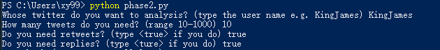

# project2phase2
## MVP
get the raw data of the account that you are interested in.
using google nlp to analyse the sentiment of the tweets.

## User Story
For example, I'm interested in basketball and I'm concerned about what NBA players doing everyday, how they feeling everyday. So I can get the tweets of Lebron James, and analyse his sentiment and also analyse the entity of his tweets, which might tell me what he is doing recently.

## About the Design

I use the tweepy and google nlp to do this project.
First, get raw data by using twitter api. This data contain a lot of messy words, so we need to clean it.
Then remove mention block, retweet block and embedded URLs.
Then send the treated data to google nlp. Using google nlp to analyze its sentiment and entity.

## Prerequest
pip install tweepy and also the google.cloud.language

pip install requests

pip install Cython

pip install matplotlib

